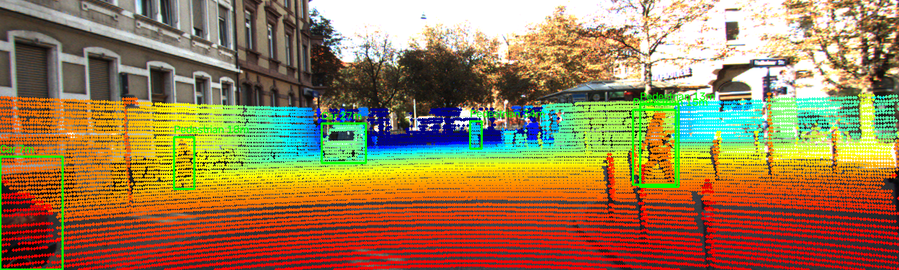
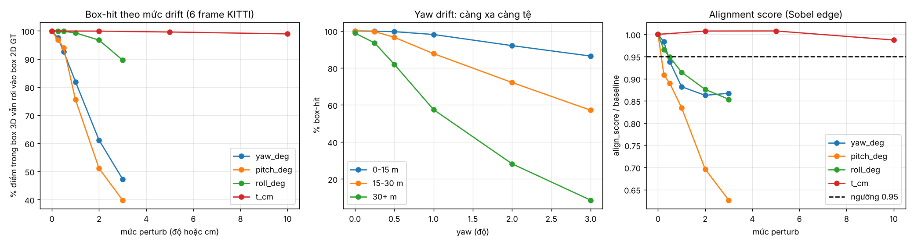
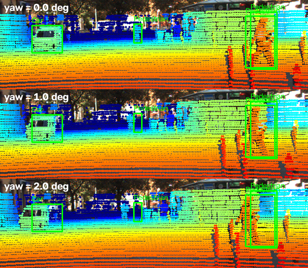
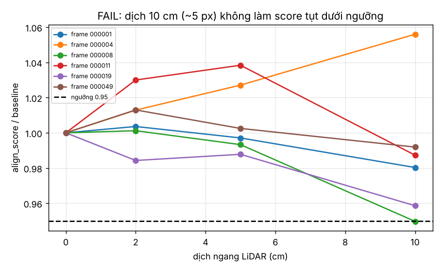

# Báo cáo Day 6: Độ nhạy của projection LiDAR→ảnh với calibration drift (KITTI)

- **Họ tên:** Nguyễn Đức Đông
- **MSSV:** 2A202602367
- **Lớp:** VinUni AI20K - Track 4
- **Link repo:** https://github.com/nguyenducdong22/NguyenDucDong-2A202602367-Track4-Day21
- **Topic:** A — Kiểm tra calibration LiDAR-camera bằng projection
- **Dataset:** data/kitti_mini, data/nuscenes_mini_subset
- **Các frame đã dùng:** KITTI 000001, 000004, 000008, 000011, 000019, 000049; nuScenes scene-0103_010/020/030, scene-1094_010/020/030

## 1. Claim

Lệch extrinsic **yaw 1°** (hoặc pitch 1°) làm % điểm LiDAR trong box 3D vẫn rơi vào box 2D đúng giảm từ ~100% xuống ~82% (yaw) / ~76% (pitch), và **ở vật >30 m chỉ còn ~58%** (yaw 1°). Ngược lại dịch ngang 10 cm gần như không ảnh hưởng (còn ~99%). Một alignment score dựa trên biên (depth edge vs image edge) phát hiện được yaw 1° ở 5/6 frame với ngưỡng 0.95 × baseline, nhưng **không phát hiện được dịch 2–10 cm**.

## 2. Evidence

Số liệu trung bình trên 6 frame (`results/calib_sweep.csv`, theo từng frame; theo khoảng cách: `results/calib_sweep_by_range.csv`; tỉ lệ phát hiện: `results/drift_detection.csv`). Không dùng random nên chạy lại ra cùng số.

| Perturb | box_hit % | median shift (px) | align_score / baseline | frame bị phát hiện (ngưỡng 0.95) |
|---|---|---|---|---|
| không (baseline) | 99.9 | 0 | 1.000 | – |
| yaw 0.5° | 92.6 | 6.9 | 0.938 | 3/6 |
| yaw 1° | 81.9 | 13.7 | 0.882 | 5/6 |
| yaw 3° | 47.3 | 41.3 | 0.867 | 5/6 |
| pitch 1° | 75.5 | 12.9 | 0.835 | 4/6 |
| roll 1° | 99.3 | 3.1 | 0.915 | 3/6 |
| dịch 5 cm | 99.6 | 2.4 | 1.008 | 0/6 |
| dịch 10 cm | 98.9 | 4.9 | 0.987 | 1/6 |

Theo khoảng cách, yaw 1°: box-hit 98.1% (0–15 m), 87.7% (15–30 m), 57.5% (>30 m).

Ảnh overlay baseline ở 3 khoảng cách: `results/figures/demo_overlay_near_000019.png`, `demo_overlay_mid_000011.png`, `demo_overlay_far_000004.png`.





**So sánh 2 dataset (bonus B5)** — `results/calib_sweep_nuscenes.csv`, 6 frame (3 ban ngày `scene-0103`, 3 ban đêm sau mưa `scene-1094`), cùng code `src/calib_sweep.py`:

| Perturb | KITTI box_hit % / shift px | nuScenes box_hit % / shift px |
|---|---|---|
| yaw 1° | 81.9 / 13.7 | 94.0 / 25.3 |
| yaw 3° | 47.3 / 41.3 | 64.3 / 76.6 |
| xoay quanh trục x của LiDAR 1° | 99.3 / 3.1 (KITTI: x = phía trước, ứng với roll) | 91.2 / 22.8 (nuScenes: x = sang phải, ứng với pitch của camera) |
| dịch 10 cm | 98.9 / 4.9 | 98.5 / 2.9 |

Giải thích khác biệt: (1) camera nuScenes có tiêu cự khoảng 1266 px so với khoảng 721 px của KITTI nên cùng 1° lệch cho nhiều pixel hơn (25 px so với 14 px); (2) hệ trục LiDAR khác nhau (KITTI x phía trước, nuScenes x sang phải) nên cùng tên trục "pitch/roll" ứng với hướng khác nhau trên ảnh; (3) box_hit của nuScenes cao hơn dù lệch pixel lớn hơn vì ảnh 1600×900 có box 2D lớn hơn và vật được chọn gần hơn; LiDAR 32 beam chỉ cho 42–175 điểm mỗi frame trong các box. Chỉ có 6 frame với rất ít điểm nên kết luận về nuScenes chỉ mang tính định hướng. `align_score` **không tính được trên nuScenes** (NaN): LiDAR 32 beam quá thưa nên có dưới 20 điểm biên độ sâu, đây là giới hạn thật của phương pháp.

**Latency (bonus B3)** — `results/latency.csv`, frame KITTI 000011 (108 004 điểm), 30 lần chạy sau khi bỏ lần đầu, CPU Intel Xeon 2.1 GHz 2 nhân (môi trường cloud, không GPU), Python 3.13, OpenCV 5.0. Chạy lại trên máy khác sẽ ra số khác.

| Bước | p50 (ms) | p95 (ms) |
|---|---|---|
| velo_to_cam | 4.6 | 5.0 |
| project_velo_to_image | 12.5 | 13.4 |
| edge_alignment_score | 14.6 | 15.8 |
| Toàn bộ kiểm tra mỗi frame | 26.5 | 28.2 |

Nhận xét: yaw/pitch 1° ≈ 13 px ở mọi khoảng cách (f ≈ 721 px), nhưng vật xa nhỏ trên ảnh nên cùng mức lệch pixel làm điểm trượt hẳn ra ngoài box. Dịch tịnh tiến 10 cm chỉ gây ~5 px nên với box lớn vẫn "trúng".

## 3. Failure case



**Fail 1 (ảnh trên).** Frame 000011, yaw 0°/1°/2°: điểm trên người đi bộ nhỏ ở xa trượt dần ra khỏi box; ở 2° các điểm xanh của nền/tường bị gán vào vật. Nếu chỉ nhìn overlay của vật to gần (xe ở 0–15 m, vẫn trúng 98% ở yaw 1°) thì kết luận "calibration ổn" là sai. Lớp lỗi: **Geometry** (extrinsic), bị che bởi **Metric** (đo trên vật gần/lớn).



**Fail 2 (ảnh trên).** Alignment score không phát hiện dịch 2–10 cm (ratio ≈ 1.0, ngưỡng 0.95), và với yaw/roll score bão hoà (yaw 2° và 3° gần như bằng nhau) vì gradient ảnh có nhiều biên nhiễu. Ngoài ra ngưỡng 0.95 chọn thủ công, chưa đo nhiễu nền nên 0.25° pitch cũng bị báo (nguy cơ báo nhầm). Lớp lỗi: **Metric** (score không đủ nhạy với tịnh tiến nhỏ). Cách phát hiện khi chạy thật: tính score trên nhiều frame có nhiều vật xa/biên rõ và theo dõi xu hướng trung bình thay vì từng frame.

## 4. Khuyến nghị nếu triển khai thật

Use-case ADAS: sensor bracket lệch ~1° sau va chạm nhẹ là đủ làm fusion sai với người đi bộ/xe ở >30 m — đúng vùng cần phản ứng sớm. Khuyến nghị: (1) chạy kiểm tra calibration định kỳ khi xe đứng/chạy chậm và log `align_score` trung bình trượt cửa sổ + box-hit nếu có detector 2D; (2) đặt ngưỡng cảnh báo từ phân bố nhiễu nền của chính xe đó, không dùng ngưỡng cố định; (3) đánh đổi: score chỉ cần CPU và vài chục ms/frame nhưng kém nhạy với tịnh tiến nhỏ, cần kết hợp tín hiệu khác (ví dụ khớp theo vật đã biết). Cần log: align_score, % điểm trong FOV, median depth edge residual, nhiệt độ/va chạm (IMU). Hạn chế: chỉ 6 frame KITTI, chưa thử nuScenes.

## 5. Cách chạy lại

```bash
python -m venv .venv && source .venv/bin/activate   # Windows: .venv\Scripts\activate
pip install -r requirements.txt
python -m starter.projection --data-root data/kitti_mini --frame 000011
python -m src.calib_sweep --data-root data/kitti_mini --frames 000001 000004 000008 000011 000019 000049
python -m src.make_figures
python -m src.calib_sweep --data-root data/nuscenes_mini_subset --frames scene-0103_010 scene-0103_020 scene-0103_030 scene-1094_010 scene-1094_020 scene-1094_030 --out results/calib_sweep_nuscenes.csv
python -m src.latency --data-root data/kitti_mini --frame 000011 --runs 30
python tools/check_submission.py
```

Mọi script trong `src/` có tham số dòng lệnh và `--help` (bonus B4). Có thể chạy lại trên Google Colab bằng `src/run_on_colab.ipynb`.

## 6. Khai báo sử dụng AI

| Công cụ | Dùng cho việc gì | Bạn đã kiểm chứng thế nào |
|---|---|---|
| Claude (Anthropic) | Viết 2 hàm TODO trong `starter/projection.py`, code `src/calib_sweep.py`, `src/make_figures.py`, `src/latency.py`, notebook Colab, script nộp bài, soạn bản nháp báo cáo; chạy code trong môi trường cloud | Overlay khớp xe/người/cột và không có điểm trên trời; CSV được sinh trực tiếp từ code; trend khớp lý thuyết (yaw 1° ≈ 13 px, f≈721). Cần tự đọc lại code và hiểu trước khi trình bày |
